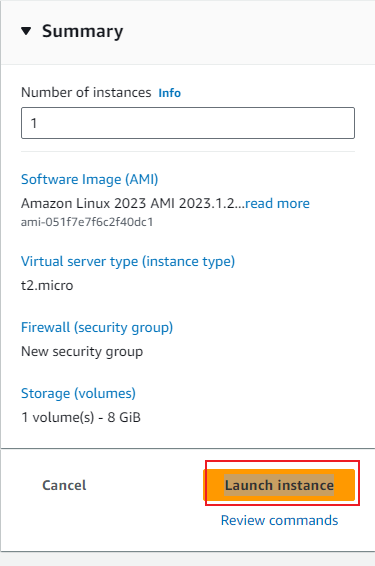

# ELB-ASG
Teaching Elastic load balancing/ Auto scaling

Launch an EC2 Instance


### Configure Storage 
leave as default


### Advanced details

add this for the user data script

```
#!/bin/bash

# Variable Declaration
#PACKAGE="httpd wget unzip"
#SVC="httpd"
URL='https://www.tooplate.com/zip-templates/2098_health.zip'
ART_NAME='2098_health'
TEMPDIR="/tmp/webfiles"

yum --help &> /dev/null

if [ $? -eq 0 ]
then
   # Set Variables for CentOS
   PACKAGE="httpd wget unzip"
   SVC="httpd"

   echo "Running Setup on CentOS"
   # Installing Dependencies
   echo "########################################"
   echo "Installing packages."
   echo "########################################"
   sudo yum install $PACKAGE -y > /dev/null
   echo

   # Start & Enable Service
   echo "########################################"
   echo "Start & Enable HTTPD Service"
   echo "########################################"
   sudo systemctl start $SVC
   sudo systemctl enable $SVC
   echo

   # Creating Temp Directory
   echo "########################################"
   echo "Starting Artifact Deployment"
   echo "########################################"
   mkdir -p $TEMPDIR
   cd $TEMPDIR
   echo

   wget $URL > /dev/null
   unzip $ART_NAME.zip > /dev/null
   sudo cp -r $ART_NAME/* /var/www/html/
   echo

   # Bounce Service
   echo "########################################"
   echo "Restarting HTTPD service"
   echo "########################################"
   systemctl restart $SVC
   echo

   # Clean Up
   echo "########################################"
   echo "Removing Temporary Files"
   echo "########################################"
   rm -rf $TEMPDIR
   echo

   sudo systemctl status $SVC
   ls /var/www/html/

else
    # Set Variables for Ubuntu
   PACKAGE="apache2 wget unzip"
   SVC="apache2"

   echo "Running Setup on CentOS"
   # Installing Dependencies
   echo "########################################"
   echo "Installing packages."
   echo "########################################"
   sudo apt update
   sudo apt install $PACKAGE -y > /dev/null
   echo

   # Start & Enable Service
   echo "########################################"
   echo "Start & Enable HTTPD Service"
   echo "########################################"
   sudo systemctl start $SVC
   sudo systemctl enable $SVC
   echo

   # Creating Temp Directory
   echo "########################################"
   echo "Starting Artifact Deployment"
   echo "########################################"
   mkdir -p $TEMPDIR
   cd $TEMPDIR
   echo

   wget $URL > /dev/null
   unzip $ART_NAME.zip > /dev/null
   sudo cp -r $ART_NAME/* /var/www/html/
   echo

   # Bounce Service
   echo "########################################"
   echo "Restarting HTTPD service"
   echo "########################################"
   systemctl restart $SVC
   echo

   # Clean Up
   echo "########################################"
   echo "Removing Temporary Files"
   echo "########################################"
   rm -rf $TEMPDIR
   echo

   sudo systemctl status $SVC
   ls /var/www/html/
fi 

```



Before we create a load balancer, we are going to do two more things 

1 Create an AMI( we will have our own AMI with the website in it and we can subsequently lanch instances from it) This means that we can create a cluster of instances with the same data.
2 Create a Launch template

## Set up an AMI

- Go to actions

- Click on `image templates`

- Click on `create image`


 name AMI and click on Create


You can copy AMI from region to region

Launch instance from AMI custom to you with all your metadata in our case a website

## Launch Template


Click on the instance then click on  actions  and click on `launch instance from template` and change tag

Click on `Launch instance`


We have now launched a new instance with our custom AMI

We want to create a single endpoint for our webservers and single endpoint is our load balancer.

## Create target group

Go to target groups. target groups is a group of instances with health checks


Click on `Instances` - Next - target group name


